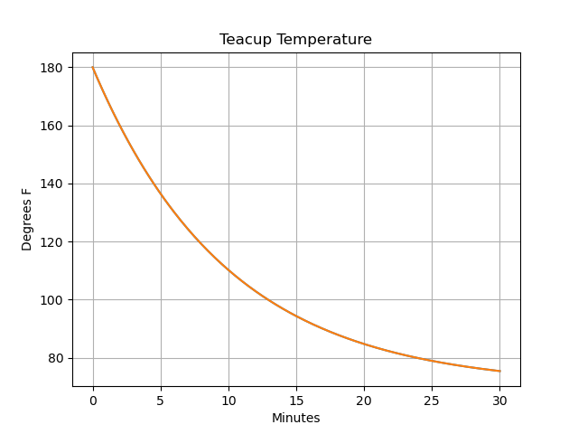

Basic Usage
===========

Importing a model and getting started
-------------------------------------
To begin, we must first load the PySD module, and use it to import a supported model file::

   import pysd
   model = pysd.read_vensim('Teacup.mdl')

This code creates an instance of the PySD class loaded with an example model that we will use as the system dynamics equivalent of ‘Hello World’: a cup of tea cooling to room temperature.

.. image:: images/Teacup.png
   :width: 350 px
   :align: center

To view a synopsis of the model equations and documentation, call the :py:func:`components.doc()` method of the model class. This will generate a listing of all the model elements, their documentation, units, equations, and initial values, where appropriate. Here is a sample from the teacup model::

   >>> print model.components.doc()

   Import of Teacup.mdl

   characteristic_time 
   Units: minutes 
   Equation: 10 
   
   dteacup_temperature_dt 
   Units: degrees 
   Equation: -heat_loss_to_room() 
   Init: 180  
   
   final_time 
   the final time for the simulation. 
   Units: minute 
   Equation: 30
   …

Running the Model
-----------------
The simplest way to simulate the model is to use the :py:func:`.run()` command with no options. This runs the model with the default parameters supplied by the model file, and returns a Pandas dataframe of the values of the stocks at every timestamp::

   >>> stocks = model.run()

   t        teacup_temperature
   0.000    180.000000
   0.125    178.633556
   0.250    177.284091
   0.375    175.951387
   …

Pandas gives us simple plotting capability, so we can see how the cup of tea behaves::

   stocks.plot()
   plt.ylabel('Degrees F')
   plt.xlabel('Minutes')
   

 
Outputting various run information
----------------------------------
The :py:func:`.run()` command has a few options that make it more useful. In many situations we want to access components of the model other than merely the stocks – we can specify which components of the model should be included in the returned dataframe by including them in a list that we pass to the :py:func:`.run()` command, using the return_columns keyword argument::

   >>> model.run(return_columns=['teacup_temperature', 'room_temperature'])
 
   t         teacup_temperature    room_temperature
   0.000     180.000000            75.0
   0.125     178.633556            75.0
   0.250     177.284091            75.0
   0.375     175.951387            75.0
   …
 
If the measured data that we are comparing with our model comes in at irregular timestamps, we may want to sample the model at timestamps to match. The .run() function gives us this ability with the return_timestamps keyword argument::

   >>> model.run(return_timestamps=[0,1,3,7,9.5,13.178,21,25,30])
   
   t       teacup_temperature
   0.0     180.000000
   1.0     169.532119
   3.0     151.490002
   7.0     124.624385
   9.5     112.541515
   …
 
Setting parameter values
------------------------
In many cases, we want to modify the parameters of the model to investigate its behavior under different assumptions. There are several ways to do this in PySD, but the .run() function gives us a convenient method in the params keyword argument. 

This argument expects a dictionary whose keys correspond to the components of the model.  The associated values can either be a constant, or a Pandas series whose indices are timestamps and whose values are the values that the model component should take on at the corresponding time. For instance, in our model we can set the room temperature to a constant value::

   model.run(params={'room_temperature':20})
 
Alternately, if we believe the room temperature is changing over the course of the simulation, we can give the run function a set of time-series values in the form of a Pandas series, and PySD will linearly interpolate between the given values in the course of its integration::

   import pandas as pd
   temp = pd.Series(index=range(30), data=range(20,80,2))
   model.run(params={'room_temperature':temp})
 
Note that once parameters are set by the run command, they are permanently changed within the model. We can also change model parameters without running the model, using PySD’s :py:func:`set_components(params={})` method, which takes the same params dictionary as the run function. We might choose to do this in situations where we’ll be running the model many times, and only want to spend time setting the parameters once.

Setting simulation initial conditions
-------------------------------------
Finally, we can set the initial conditions of our model in several ways. We’ll get into why this is helpful in the next section. So far, we’ve been using the default value for the initial_condition keyword argument, which is ‘original’. This value runs the model from the initial conditions that were specified originally by the model file. We can alternately specify a tuple containing the start time and a dictionary of values for the system’s stocks. Here we start the model with the tea at just above freezing::

   model.run(initial_condition=(0, {'teacup_temperature':33}))
 
Additionally we can run the model forward from its current position, by passing the initial_condition argument the keyword ‘current’. After having run the model from time zero to thirty, we can ask the model to continue running forward for another chunk of time::

   model.run(initial_condition='current',   
             return_timestamps=range(31,45))
 
The integration picks up at the last value returned in the previous run condition, and returns values at the requested timestamps.

Querying current values
-----------------------
We can easily access the current value of a model component by calling its associated method in the components subclass. For instance, to find the temperature of the teacup, we simply call::

   model.components.teacup_temperature()

Collecting a history of returned values
---------------------------------------
The :py:func:`.run()` function provides a flag named collect that instructs PySD to collect all output from a series of run commands into a record. This can be helpful when running the model forwards for a period of time, then returning control to the user, who will specify changes to the model, and continue the integration forwards. 

The record is stored as a list of Pandas dataframes, one from each run. To access this record in its raw form, the user can access the :py:func:`.record` attribute of the PySD class. It is usually more helpful to have a single dataframe which stitches together all of these pieces. We can access this via the :py:func:`.get_record()` method.
