The "4+1" Model View of Software Architecture
=============================================
.. _4+1 model view: https://www.cs.ubc.ca/~gregor/teaching/papers/4+1view-architecture.pdf

.. warning::
  This page is outdated as it was written for PySD 2.x. However, the content here could be useful for developers.
  For PySD 3+ architecture see :doc:`Structure of the PySD module  <../../structure/structure_index>`.

The `4+1 model view`_, designed by Philippe Krutchen, presents a way to describe the architecture of software systems, using multiple and concurrent views. This use of multiple views allows to address separately the concerns of the various 'stakeholders' of the architecture such as end-user, developers, systems engineers, project managers, etc.

The software architecture deals with abstraction, with decomposition and composition, with style and system's esthetic. To describe a software architecture, we use a model formed by multiple views or perspectives. That model is made up of five main views: logical view, development view, process view, physical view and scenarios or user cases.

* The Physical View: describes the mapping of the software onto the hardware and reflects its distributed aspect

* The Development view: describes the static organization of the software in its development environment.

* The logical view: is the object model for the design

* The process view: captures the concurrency and synchronization aspects of the design

* The scenarios: show how the four views work together seamlessly

The "4+1" Model View of PySD
----------------------------

The development view of PySD
~~~~~~~~~~~~~~~~~~~~~~~~~~~~

A package diagram, represented in the figure `PySD development view`_, is used to represent the architecture of the fragments that make up *PySD*. This diagram represents the hierarchical architecture of PySD packages, excluding the relationship between their modules. In `PySD relationships between modules`_ we can find the relationships between PySD modules.

.. _PySD development view:

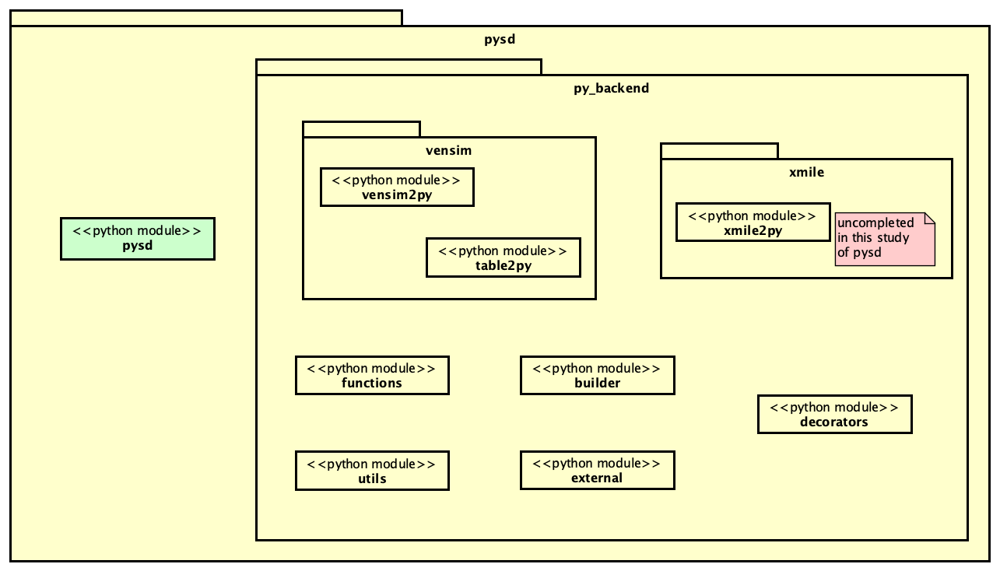

   PySD development view

**pysd** is the main package that includes all the others and all the logic of the system. It is necessary to differentiate between the package called **pysd** and the module called pysd. The latter allows the user to interact with the system and has the appropiate functions to be able to translate a Vensim or XMILE model and, in addition, to execute the generated translation. However, the XMILE translation process is not defined in this document.

The **pysd** module interacts with the modules of the **py_backend** package. This package has two sub-packages: **vensim** and **xmile**. The **vensim** package contains all the logic needed to translate *Vensim* models.

In `PySD relationships between modules`_ the relationships between the main modules are represented. For clarity, each module is represented with its name package.

.. _PySD relationships between modules:

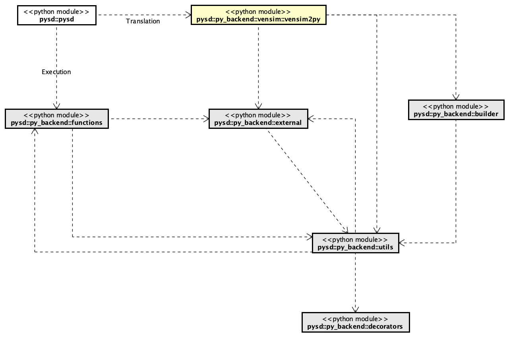

   PySD relationships between modules

As mentioned above, users interact with **pysd** module. In turn, **pysd**  is responsible for translating the *Vensim* model into the *Python* model by interacting with **vensim2py**, which creates the correct *Python* translation. In this process, **vensim2py** interacts with and uses the functions of the modules: **external**, **utils** and **builder**. To carry out the execution process, **pysd** uses the **functions** module.

The logical view of PySD
~~~~~~~~~~~~~~~~~~~~~~~~~~~~

The purpose of each PySD module is detailed below, as well as the most important functions of each module.

It should be noted that in diagrams it has been necessary, input parameters have been detailed with *in* notation, output parameters with *out* notation and parameters that are modified in a function with *inout* notation. In addition, the different types of parameters that could be, are described by notes in convenient diagrams, which is due to Python's dynamic typing.

In `Main modules of PySD`_: **pysd**, **vensim2py** and **table2py** modules are presented in detail. The **pysd** module is in the *pysd* package, while the **vensim2py** and **table2py** modules are in the *vensim* package.

The **pysd** module has the necessary functions to allow the user to create the translation of a Vensim model into Python. The :py:func:`.read\_vensim` function takes a Vensim model in text format as a parameter and converts it into an instance of the Model class, which is in the **functions** module. Also, **pysd** has the  :py:func:`.load` function, which can generate from a Python model to an instance of the *Model* class, which may be able to execute and perform the simulation. The :py:func:`.load` function is used inside the :py:func:`.read\_ vensim` function.

.. _Main modules of PySD:

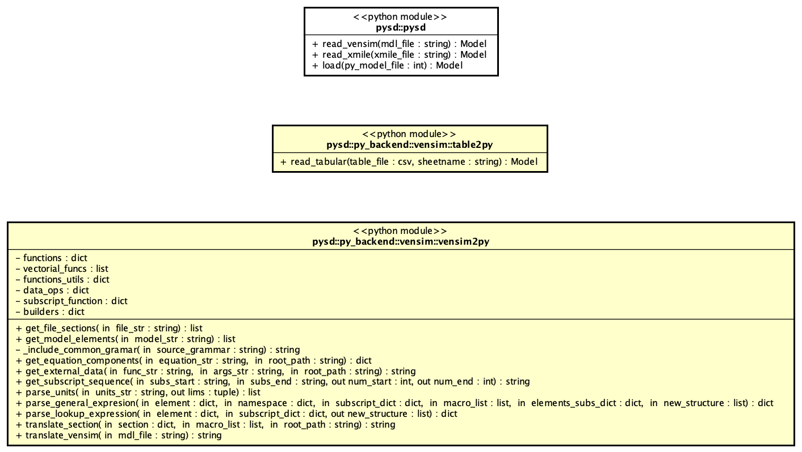

   Main modules of PySD

The **table2py** module has only one function, :py:func:`.read_tabular`. This function allows to read a Vensim model in table form (csv, tab or xlsx) and convert it into an instance of the Model class.

In addition, **vensim2py** is represented in that diagram. In **vensim2py**, the five grammars of *PySD* are defined, with their associated classes that allow parsing and obtaining the information from a Vensim model.

The main function of the *vensim2py* module, which is also used by the :py:func:`.read\_vensim` function of **pysd** module, is :py:func:`.translate\_vensim`. This function starts the translation process. The Vensim model is parsed with the first pysd grammar, *file\_structure\_grammar*, found in the :py:func:`.get\_file\_sections` function. The *file\_structure\_grammar* divides the model into sections: the main section with the main code of the model and on the other hand, a section for each macro in the model. The obtained sections are passed as parameters to :py:func:`.translate\_section` function afterwards.

The functions :py:func:`.get\_model\_elements`, :py:func:`.get\_equation\_components`, :py:func:`.parse\_general\_expression` and :py:func:`.parse\_lookup\_expression` have the four remaining grammars of PySD which are: *model\_structure\_grammar*, *component\_structure\_grammar*, *expression\_grammar* and *lookup\_grammar*, respectively. In addition, after each of these functions, the NodeVisitor classes associated with each grammar are defined. These classes allow the parse tree to be performed and parsed.

Noteworthy is the function :py:func:`.\_include\_common\_grammar`  which has the basic grammar rules used by all other grammars.

Due to the complexity of **vensim2py**, as it has the five functions in which PySD grammars and their visitor classes are defined, in `Simplified vensim2py module`_ it is represented without detail. These classes are: FileParser, ModelParser, ComponentParser, ExpressionParser and LookupParser. Note that these classes inherit from the NodeVisitor class, that provides an inversion-of-control framework for walking a tree and returning a new construct based on it.

.. _Simplified vensim2py module:

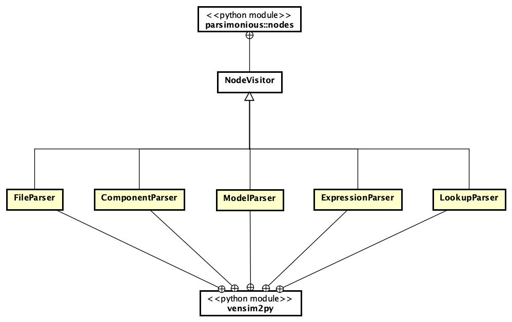

   Simplified vensim2py module

In `Classes of pysd grammars (Part 1)`_ and `Classes of pysd grammars (Part 2)`_ are represented the classes associated to the grammars.

.. _Classes of pysd grammars (Part 1):

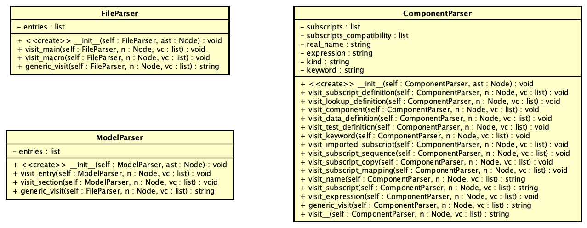

   Classes of pysd grammars (Part 1)

.. _Classes of pysd grammars (Part 2):

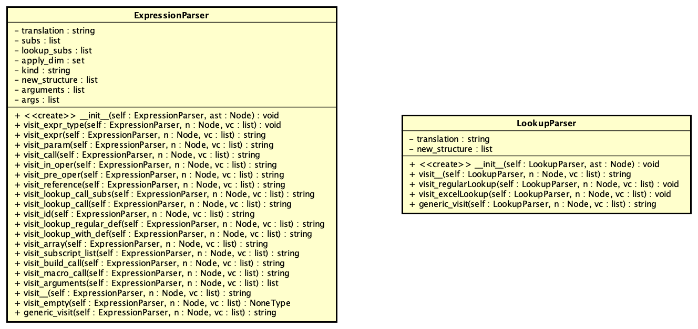

   Classes of pysd grammars (Part 2)

The methods of each class are the visitor methods associated with the different grammar rules. There is no visitor method for each rule, but there is a visitor method associated with a rule that serves to store certain information about the parsed model. Within the visitor method, that relevant information is stored in the attributes of each class, which are then returned as a result of the grammar.

Visitor methods always have three parameters: *self*, *n* and *vc*. *Self* represents the current instance of the class, *n* is of type Node and is the node being visited, and *vc* or *visit children* is a list of all the results of the child nodes of the expression being parsed. From that last parameter, vc, the information is taken and stored in the attributes of the classes.

The **functions** module is represented in `Simplified functions module`_. It is one of the most important modules in PySD, since it has the classes that will instantiate the Python translation model and also has the logic needed to run the simulation. That diagram represents the classes it has and the relationships between them.

.. _Simplified functions module:

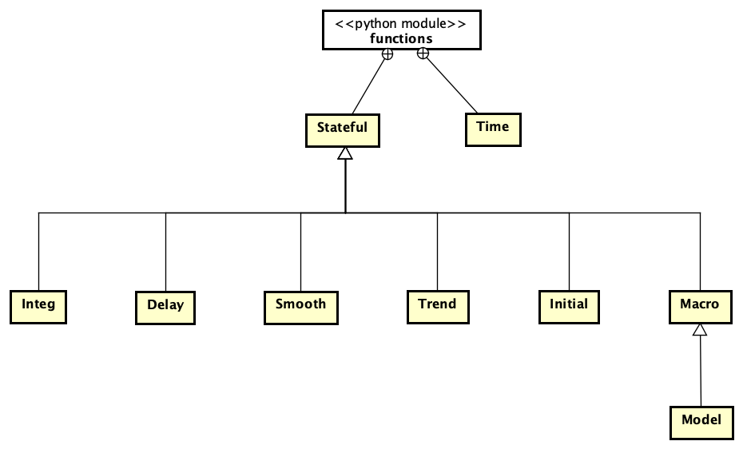

   Simplified functions module

The **functions** module in detail can be found in the `Functions module (Part 1)`_ diagram as well as the **Time** class that is define in this module. In **functions**, we can find many functions that are used in Vensim but with the relevant logic in Python, for example: PULSE, IF THEN ELSE, RANDOM UNIFORM, etc.

The Time class represents the time throughout the simulation. The *t* attribute represents the current time, which changes as the simulation progresses, and the *step* attribute represents the time increment that occurs in each iteration.

.. _Functions module (Part 1):
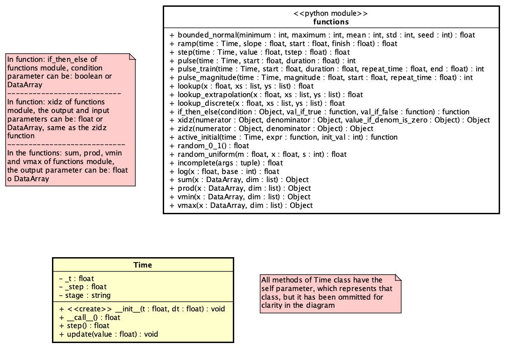

   Functions module (Part 1)

In the diagram `Functions module (Part 2)`_ the classes of the **functions** module Stateful, Integ, Macro and Model are represented in detail. The Stateful class is one of the most relevant classes of that module, since, except Time, all the classes inherit from it. This class makes it possible to represents the evolution of the state  of a certain element models, recreating the simulation process in Vensim. To do so, it has an attributed called *state* that simulates the state of the elements and changes its value in each iteration of the simulation.

.. _Functions module (Part 2):
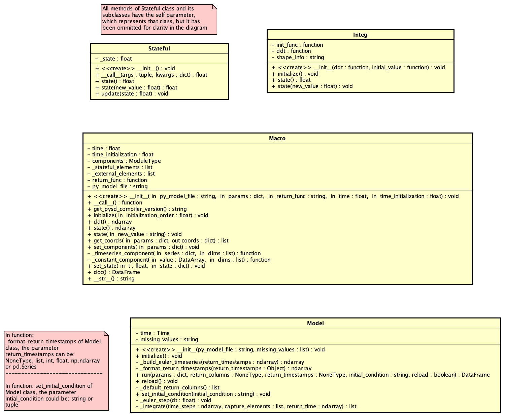

   Functions module (Part 2)

The Integ class simulates the Vensim stocks. It receives and stores an initial value and has the function from which the derivative necessary to perform the integration is obtained.

The Model class stores all the information about the main code of the (translated) model. An instance of this class is called a pysd model, it is the Python language representation of the Vensim file.  That is, the Model class implements a representation of the stateful elements of the model and has most of the methods to access and modify the components of the model. In addition, the Model class is in charge of instantiating the time as a function of the model variables and it is also in charge of performing the simulation through Euler integration.

The :py:func:`.initialize` function of that class initialize the model simulation. The :py:func:`.run` function allows to simulate the behaviour of the model by increasing steps. And the :py:func:`.\_euler\_step` function allows to do the Euler integration in a single step, using the state of the Stateful elements and updating it.

The Model class inherits from Macro class. The logic for rendering Vensim macros is implemented in Macro class. This class obtains the stateful objects that have been created in the translation process and they are initialized to later obtain their derivates and the results of the execution. Model does the same functions as Macro, but Model is the root model object so it has more methods to facilitate execution.

Next, in `Builder module`_ figures the **builder** module. There is no class defined in this module, but it is in charge of making the text model in Python, using the results obtained in the translation. It has the necessary code to assemble in a pysd model all the elements of both Vensim or XMILE and make, from these, a Python-compatible version.

.. _Builder module:
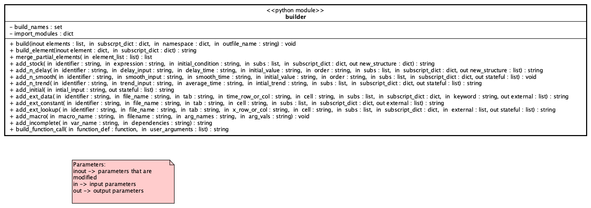

   Builder module

The main function of the **builder** module is :py:func:`.build`. That function builds and writes the Python representation of the model. It is called from the **vensim2py** module after finishing the whole process  of translating the Vensim model. As parameters it is passed the different elements of the model that have been parsed, subscripts, namespace and the name of the file where the result of the Python representation should be written. This function has certain permanent lines of code that are always write in the models created, but then, there are certain lines of code that are completed with the translation generated before in the **vensim2py** module.

In image `Utils module`_ is found the **utils** module. The main purpose of utils is to bring together in a single module all the functions that are useful for the project. Many of these functions are used many times during the translation process. So, as already presented in `PySD relationships between modules`_, this module is used by the **builder**, **functions**, **external** and **vensim2py** modules. In turn, the accesible names of the **decorators**, **external** and **functions** modules are imported into the **utils** modules to define a list of the names that have already been used and that have a particular meaning in the model being translated.

.. _Utils module:

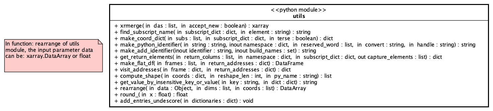

   Utils module

`Simplified external module`_ represents the **external** module and the classes it contains without detail. The main purpose of the classes defined in that module is to read external data. The main objective of the external module is to gather in a single file, all the required functions or tools to read external data files.

.. _Simplified external module:

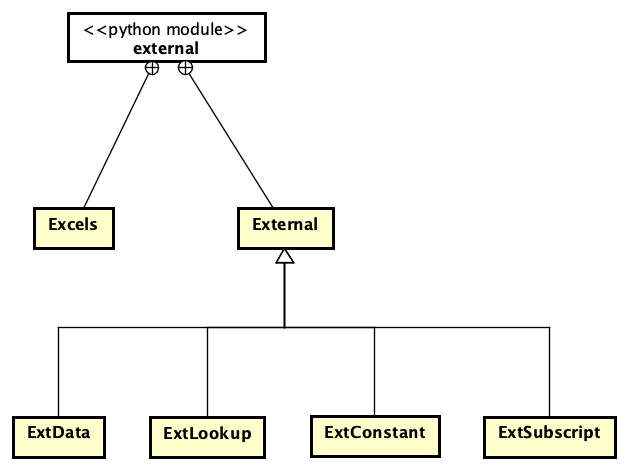

   Simplified external module

The figure `External module (Part 1)`_ shows the detailed diagrams of the External and Excels class.

External is the main class of that module, all other classes inherit from it, except the Excels class.

.. _External module (Part 1):

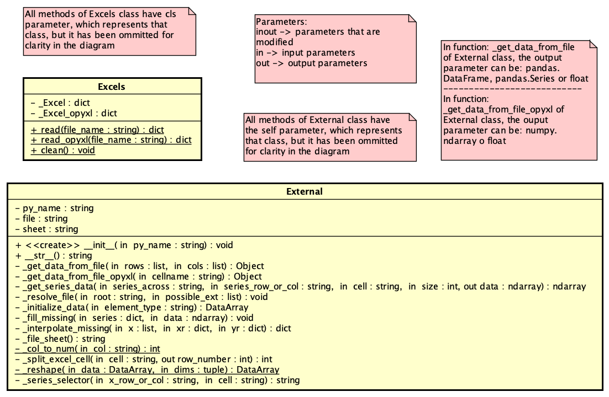

   External module (Part 1)

The External class allows storing certain information, such as the name of the file being read and the data it contains.

The Excels class is in charge of reading Excel files and storing information about them, in order to avoid reading these files more than once, implementing the singleton pattern.

In `External module (Part 2)`_ all the classes that inherit from the External class are presented.

.. _External module (Part 2):
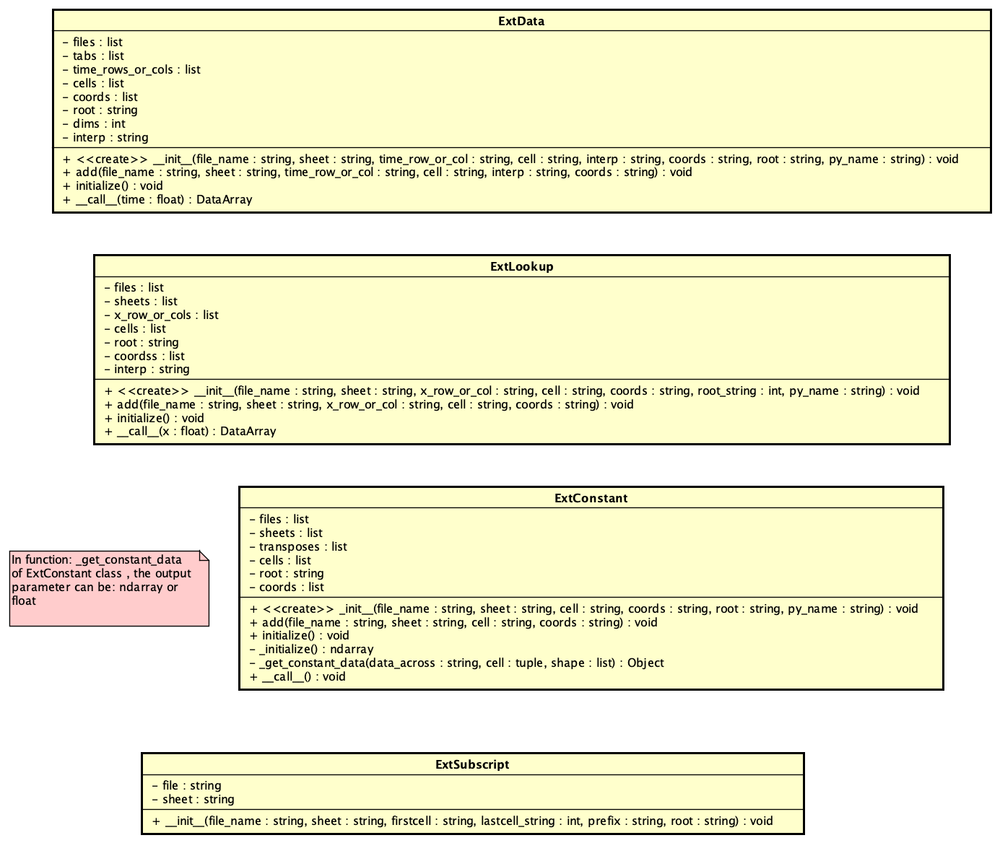

   External module (Part 2)

In Vensim there are different statements that allow to obtain data from external files that are used as variables in a Vensim model. Below is the set of these functions that are supported in PySD.

To obtain data from statements like GET XLS DATA and GET DIRECT DATA, there is the ExtData class. In turn, for the GET XLS LOOKUPS and GET DIRECT LOOKUPS statements, the ExtLookup class. For the GET XLS CONSTANT and GET DIRECT CONSTANT functions, the ExtConstant class and, finally, to implement the GET XLS SUBSCRIPT and GET DIRECT SUBSCRIPT function, the ExtSubscript class.

These expressions create a new instance of the External class where the information to represent the necessary data structures is stored. These instances of the External class are initialized before the stateful objects.

To better understand the functionality and the reason for the next module presented, called **decorators**, it would be advisable to know the `Decorator pattern <https://refactoring.guru/design-patterns/decorator>`_.

In PySD, a kind of two-level cache is implemented to speed up model execution as much as possible. The cache is implemented using decorators. In the translation process, each translated statement or function is tagged with one of two types of caches. The @cache.run decorator is used for functions whose value is constant during model execution. In this way, their value is only calculated once throughout the execution of the model. On the other hand, functions whose values must change with each execution step are labeled with the @cache.step decorator.

In `Decorators module`_ figure the **decorators** module is detailed where the functions to develop and decorate the functions of the model in the translation step are located.

.. _Decorators module:
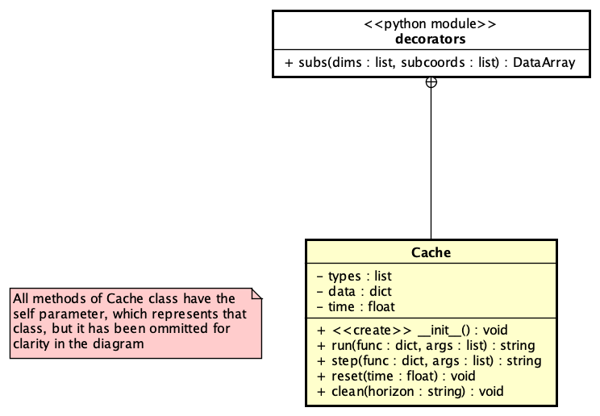

   Decorators module

The Cache class allows to define the functionality of these decorators. The :py:func:`.run` and :py:func:`.step` functions define the functionality of the two-level cache used in PySD. The :py:func:`.reset` function resets the time entered as a parameter and clears the cache of values tagged as step. The :py:func:`.clean` function clears the cache whose name is passed as a parameter.

The process view of PySD
~~~~~~~~~~~~~~~~~~~~~~~~~~~~

Activity diagrams are used to represent the PySD process view. The `Main process view`_ is the main activity diagram of PySD, the other diagrams presented in the next figures are a breakdown of this.

.. _Main process view:
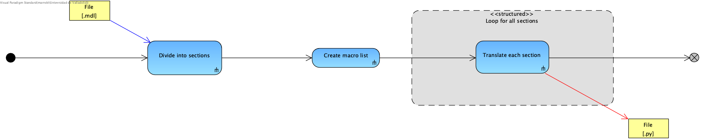

   Main process view

The translation process begins when the user indicates the Vensim model (.mdl extension) to be translated, using the :py:func:`.read\_vensim` function of the **pysd** module. In this function, the :py:func:`.translate\_vensim` function is called internally, which is passed as a parameter the Vensim model and is found in the **vensim2py** module. This is when the file path extension is modified, changing the extension from mdl to py, so the translated model in Python will be saved in the same path as the Vensim model. Then, the sections that make up the model are split and, subsequently, from these obtained sections, a list is created with all macros in the model. Also, each section is organized and translated resulting in translation to complete the Python file. The subsystems that make up the `Main process view`_ diagram are explained in more detail bellow.

The figure `Divide into sections`_ shows the first subsystem. Inside the :py:func:`.translate\_vensim` function, the Vensim model is read in text mode and the grammar file\_structure\_grammar is responsible for separating the macros and the main code. This grammar is defined in the :py:func:`.get\_file\_sections` function, in **vensim2py** module. In turn, in this function defines the class that has the visitor methods associated with the grammar rules, called FileParser. As result of this function and grammar, the text of the model is divided into a list with the different sections that compose it, and a section is obtained for each macro of the model and other section with the main code.

.. _Divide into sections:
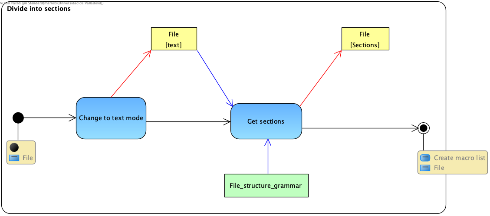

   Divide into sections

Once the 'Divide into sections' sequence is complete, it continues to create a list of macros, shown in `Create macro list`_ diagram. In this section of the translation all the sections labeled as macro are filtered to store them all in a list. So all the macros of the Vensim model are centralized in a single list.

.. _Create macro list:
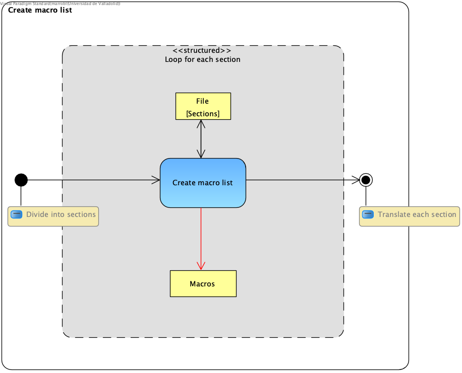

   Create macro list

Next, each section in which the Vensim model has been divided into before, is organized and translated with the :py:func:`.translate\_section` function of the **vensim2py** module.

`Organize each section`_ shows this sequence in detail, with its sub-activities developed in `Create Python namespace`_ and `Parse each component`_ diagrams.

.. _Organize each section:
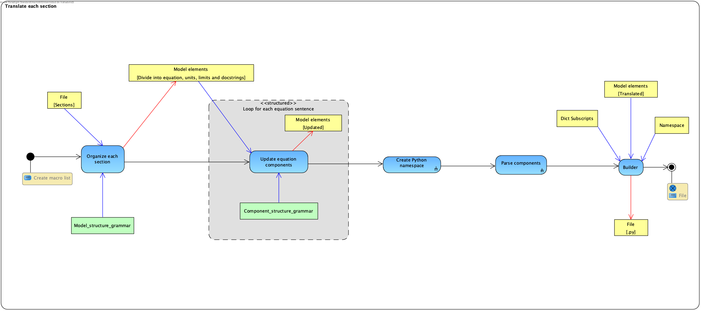

   Organize each section

In the figure `Organize each section`_, from the :py:func:`.get\_model\_elements` function (vensim2py module), each section is parsed with the grammar model\_structure\_grammar, which is responsible for organizing and updating the sections to elements of the model depending on whether they are equations or comments. In the :py:func:`.get\_model\_elements` function, in addition to this grammar, the NodeVisitor class associated with it is defined  which is called ModelParser. The model\_structure\_grammar grammar results the model divided into elements that, in turn,  are organized by: equation, units, limits, doc and the kind of the statement. Later, as the model progresses through the different grammars of PySD, the new labels into which these elements are divided are update or added to the stored.

The elements that have been classified as comments do not influence the translation of the Vensim file, they are only useful for model developers. For this reason, a filter of all the model elements has been placed and the equation elements will be updated through the component\_structure\_grammar grammar, which is shown in `Organize each section`_. This grammar adds more information about the name and the kind of equation. In summary, this grammar allows updating and detailing the information of the elements of the model that are equations. The component\_structure\_grammar grammar is in the :py:func:`.get\_equation\_components` function of the vensim2py module as well as the NodeVisitor class, which contains the necessary logic and is called ComponentParser.

.. _Create Python namespace:
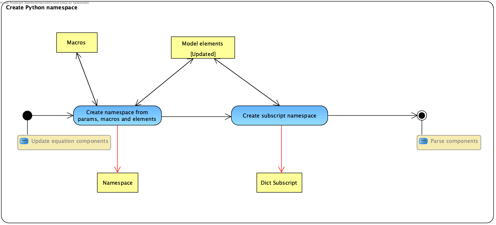

   Create Python namespace

The ''Create Python namespace'' subsystem is presented in the figure `Create Python namespace`_, which is the next step in the translation process. The namespace is a dictionary made up of variables names, subscripts, functions and macros that are contained in the Vensim file. To these names, a safe name in Python is assigned. To create a safe name in Python is necessary to substitute some characters that are allowed in Vensim variables but in Python they are not valid in variable names, such as spaces, key words, unauthorized symbols, etc. In this dictionary, Vensim names are stored as the dictionary 'keys' and the corresponding safe names in Python are stored in the dictionary 'values'.

To do this, inside translate\_section, you can access the list of macros obtained previously and the different sections that have been updated. With each macro name, each macro parameter and other elements of the model, a record is added to the namespace dictionary with the name that represents it in Vensim and the corresponding name in Python, generated from the make\_python\_identifier function of the **utils** module. Later, another dictionary is created to add names of subscripts that make up the model, as shown in the figure `Create Python namespace`_. The names of the subscripts are stored in another dictionary because they are not used to create Python functions, they only represent the dimensions of the DataArrays and do not need to have a safe name in Python. So, this subscript dictionary is made up of all subscripts in the model and it has the subscript name as the dictionary key and the subscripts values associated with it as the dictionary values.

Once the namespace is created, the different components continue to be parsed, as shown in the figure `Parse each component`_ (subsystem of `Organize each section`_). At this point in the translation sequence, the elements of the model are divided by kind, such as regular expressions or lookups definitions.

.. _Parse each component:

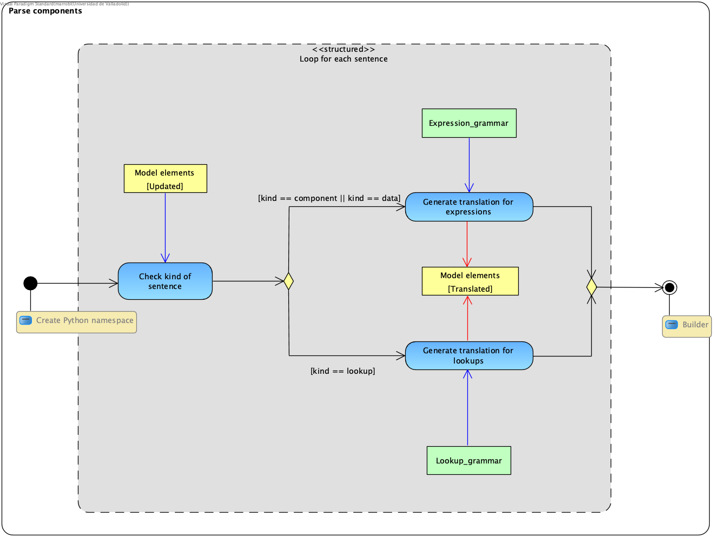

   Parse each component

If it is an equation, it will be parsed with the expression\_grammar grammar and if it is a lookup, the the lookup\_grammar grammar will be used. The first grammar commented, expression\_grammar, is found in the :py:func:`.parse\_general\_expression` function of the **vensim2py** module, where the ExpressionParser class is also defined, which contains all the logic associated with this grammar.

The lookup\_grammar grammar and its associated class, LookupParser, are defined in the :py:func:`.parse\_lookup\_expression` function of **vensim2py** module. Both grammars update the stored elements again, adding the corresponding Python translation as a new label on each element.

Once this sequence has been completed and returning to the figure `Organize each section`_, the PySD translation process ends with the builder. The **builder** module is in charge of creating the Python file containing the translation of the Vensim model, using the :py:func:`.build` function of this module. To do this, it used the namespaces created in the process and the different elements of the model previously translated and tagged with the relevant information, which will became part of the final Python file.

The physical view of PySD
~~~~~~~~~~~~~~~~~~~~~~~~~~~~

*PySD* system is deployed on a single workstation and everything that is needed is in the same component. Therefore, capturing the physical view of PySD in a deployment diagram would not add more information about the system.

Scenarios of PySD
~~~~~~~~~~~~~~~~~~~~~~~~~~~~

Two main scenarios can be distinguished throughout the *PySD* library project. The process of **translating** a model from Vensim to Python is the first scenario. The second scenario found is the **execution** of that translated model before, which allows the simulation to be carried out and allows the user to obtain the results of the Vensim model.
