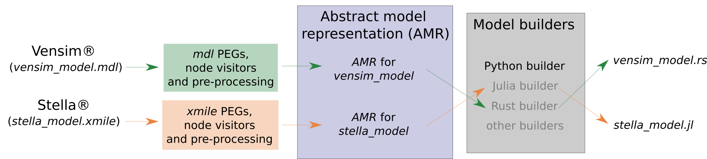

Structure of the PySD library
=============================

PySD provides translators that allow to convert the original model into an Abstract Model Representation (AMR), or :doc:`Abstract Model <abstract_model>` for short. This representation allows to gather all the model equations and behavior into a number of Python data classes. Therefore, the AMR is Python code, hence independent of the programming language used to write the original model. The AMR is then passed to a builder, which converts it to source code of a programming language of our choice. See the example of the complete process in the figure below.

Currently, PySD can translate Vensim models (mdl format) or models in Xmile format (exported from Vensim, Stella or other software) into an AMR. The only builder available at the moment builds the models in Python.

For models translated to Python, all the necessary functions and classes to run them are included in PySD. The :py:class:`Model` class is the main class that allows loading and running a model, as well as modifying the values of its parameters, among many other possibilities.

Translation
-----------

.. toctree::
   :hidden:

   vensim_translation
   xmile_translation
   abstract_model

PySD currentlty supports translation :doc:`from Vensim <vensim_translation>` and :doc:`from Xmile <xmile_translation>`.

PySD can import models in Vensim's \*.mdl file format and in XMILE format (\*.xml, \*.xmile, or \*.stmx file). `Parsimonious <https://github.com/erikrose/parsimonious>`_ is the Parsing Expression Grammar `(PEG) <https://en.wikipedia.org/wiki/Parsing_expression_grammar>`_ parser library used in PySD to parse the original models and construct an abstract syntax tree. The translators then crawl the tree, using a set of classes to define the :doc:`Abstract Model <abstract_model>`.

When parsing the expressions of any language, the order of operations must be taken into account. The order is shown in the following table and is used to create :py:class:`ArithmeticStructure` and :py:class:`LogicalStructure` objects correctly. The following expression :py:data:`1+2*3-5` will be translated to::

   ArithmeticStructure(operators=['+', '-'], arguments=(1, ArithmeticStructure(operators=['*'], arguments=(2, 3)), 5))

While something like :py:data:`1<5 and 5>3`::

   LogicStructure(operators=[':AND:'], arguments=(LogicStructure(operators=['<'], arguments=(1, 5)), LogicStructure(operators=['>'], arguments=(5, 3))))

The parenthesis also affects same order operators, for example :py:data:`1+2-3` is translated to::

   ArithmeticStructure(operators=['+', '-'], arguments=(1, 2, 3))

While :py:data:`1+(2-3)` is translated to::

   ArithmeticStructure(operators=['+'], arguments=(1, ArithmeticStructure(operators=['-'], arguments=(2, 3))))

It is important to maintain this order because although these operations by definition are commutative due to the numerical error due to the precision, they may not be commutative in the integration.

.. csv-table:: Arithmetic order
   :file: ../tables/arithmetic.csv
   :header-rows: 1

Building the model
------------------

.. toctree::
   :hidden:

   python_builder

The builders allow to build the final model in any programming language (so long as there is a builder for that particular language). To do so, they use a series of classes that obtain the information from the :doc:`Abstract Model <abstract_model>` and convert it into the desired code. Currently PySD only includes a :doc:`builder to build the models in Python <python_builder>` . Any contribution to add new builders (and solvers) for other programming languages is welcome.

The Python model
----------------

For loading a translated model with Python see :doc:`Getting started <../../getting_started>` or :doc:`Model loading <../../python_api/model_loading>`. The Python builder constructs a Python class that represents the system dynamics model. The class maintains a dictionary representing the current values of each of the system stocks, and the current simulation time, making it a `stateful` model in much the same way that the system itself has a specific state at any point in time.

The :doc:`Model class <../../python_api/model_class>` also contains a function for each of the model components, representing the essential model equations. Each function contains its units, subcscripts type infromation and documentation as translated from the original model file. A query to any of the model functions will calculate and return its value according to the stored state of the system.

The :doc:`Model class <../../python_api/model_class>` maintains only a single state of the system in memory, meaning that all functions must obey the Markov property  - that the future state of the system can be calculated entirely based upon its current state. In addition to simplifying integration, this requirement enables analyses that interact with the model at a step-by-step level.

Lastly, the :doc:`Model class <../../python_api/model_class>` provides a set of methods that are used to facilitate simulation. The :py:meth:`.run` method returns to the user a Pandas dataframe representing the output of their simulation run. A variety of options allow the user to specify which components of the model they would like returned, and the timestamps at which they would like those measurements. Additional parameters make parameter changes to the model, modify its starting conditions, or specify how simulation results should be logged.
