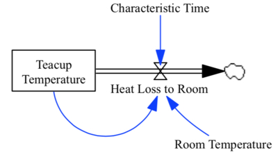

## Summary

System Dynamics (SD) is a mathematical approach used to describe and simulate the dynamics of complex systems over time. The foundations of the methodology were laid in the 1950s by Professor Jay W. Forrester of the Massachusetts Institute of Technology (MIT) [@Forrester:1971]. The building blocks of SD models are stocks, flows, feedback-loops and lookup tables. Stocks represent cumulative quantities which take a certain value at each moment in time (integral); flows are the rates at which those quantities change per unit of time (derivative); feedback-loops are output variables that are routed back as inputs to the model; and lookup tables are single argument functions that return one value or another from a predefined set, depending on the argument value. The relationships between these model components are frequently represented using causal loop diagrams (Figure \ref{fig:teacup}).

Since its inception, the SD methodology has been applied in different areas, including manufacturing, energy, climate, population, ecology and economics [@croads:2012;@Moallemi:2021;@FETENEADANE2019212;@harvey:2021]. In the 1990s, the popularity of the methodology gave rise to the development of several visual programming systems for building SD models. These modeling platforms were widely adopted by the SD community due to their convenient graphical user interfaces (GUIs). Stella&#174; and Vensim&#174; are two of the main commercial exponents of such modeling paradigm, but many others exist (see @wiki:Comparison_of_system_dynamics_software;@sdopentools). 

PySD [@pysd:2014] is a Python library that allows to transpile (to Python), load, parametrize and execute SD models built using Stella&#174; or Vensim&#174;. It was first released in September 2014 by James Houghton, and since then there have been 26 public releases, being *v2.2.0* the most recent (December 2021) at the time of writing. 

In a nutshell, the main functional elements of PySD are 1) several parsing expression grammars (PEG) (and their corresponding node visitor classes) to parse models built using Stella&#174; and Vensim&#174; (in *.xmile* and *.mdl* formats, respectively); 2) reverse engineered implementations of the most frequently used Stella&#174; and Vensim&#174; built-in functions and other basic operations; 3) a builder, to write the parsed model code in Python; 4) a fordward Euler solver to run the models; and 5) a command-line interface to manage user interactions with the models.

In addition to the aforementioned core functionality, PySD also allows to: import model inputs from external sources (from spreadsheet files); modify model variables at runtime; split models in any number of modules and submodules (corresponding to Vensim&#174; views); isolate parts of the model and run them individually; store intermediate simulation results and resume the simulation from that particular statebuild; and run models using PySD alone (without Stella&#174; or Vensim&#174;), though this was not a design premise. Additional features are planned for inclusion in furhter releases.

## Statement of need

Stella&#174; and Vensim&#174; are excellent tools for model conceptualization and design using casual loop diagrams. Their solvers are also easy to parametrize, efficient (implemented in C and C++) and throughly tested. Other than that, the Python ecosystem offers comparable open-source alternatives for data visualization, sensitivity analysis, graph theory, machine learning and other data analysis tools. Most importantly, though models created using Stella&#174; and Vensim&#174; can be exported into text format (*.xmile* and *.mdl*, respectively), the implementation of the built-in functions included in these files is not available to the user. Consequently, in order to share the models built using these platforms, the recipients must install propietary software (though free of cost) in order to run them and visualize the results. 

PySD was not aimed at competing with these platforms in their own game, but rather to extend their functionalities, and to give the large Stella&#174; and Vensim&#174; user-base the possibility to make their models fully open-source and sharable.

The actual use-cases in which PySD is being applied by the SD community goes beyond the authors knowledge. However, the latest developments of the library have taken place in the context of the European H2020 projects MEDEAS [@medeasproj] and LOCOMOTION [@locomotionproj], in which several authors of the present work participate. The MEDEAS project ended in early 2020, and aimed at developing an Integrated Assessment Model (IAM), named *pymedeas* [@pymedeas:2020;@samso:2020], to analyze different energy transition scenarios under biophysical constraints (e.g. climate change and resource availability). The LOCOMOTION project, which is still ongoing (2019-2023), aims to build a new and more complex IAM, departing from the one developed during the MEDEAS project. In MEDEAS the model was built using Vensim&#174;, and later translated to Python using PySD, and the same approach is being used in the LOCOMOTION project.

## Acknowledgements

This work and part of the development of PySD was supported by the European Union through the funding of the MEDEAS and LOCOMOTION projects under the Horizon 2020 research and innovation programme (grant agreements No 69128 and 821105, respectively).
The authors of this paper would like to acknowledge all contributors from the SD community, which have helped improve PySD and kept the project alive for the 8 years since it was created. 

## References
