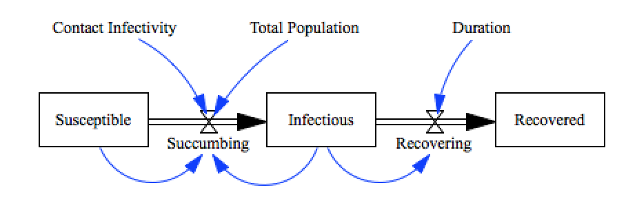
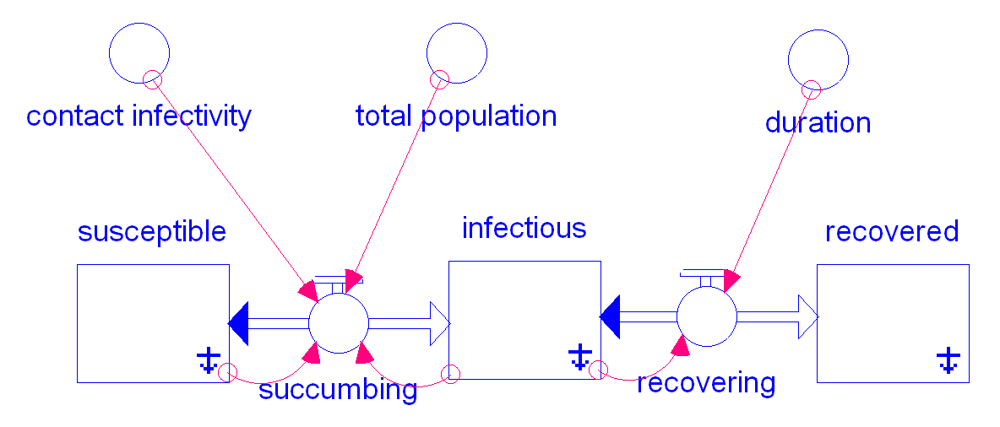
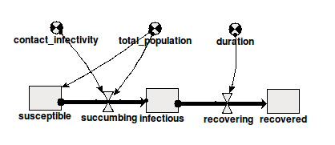

SIR Benchmark
=============

This model is a standard SIR model with a small timestep.  The
[`SIR_reciprocal-dt.xmile`](SIR_reciprocal-dt.xmile) model stores the
DT as a reciprocal.

Notes
-----
RM, 2015-11-22: SIR_simile_from_xmile.pl is the Simile version, in Prolog format, of the SIR model translated automatically from SIR.xmile, using the xmile_to_simile.pl converter.

Contributions
-------------

| Component                 | Author              | Contact                    | Date       | Software Version          |
|:------------------------- |:--------------------|:-------------------------- |:---------- |:------------------------- |
| SIR.mdl                   | James Houghton      | james.p.houghton@gmail.com | 2015-08-27 | Vensim DSS 6.3 for Mac    |
| output.csv                | James Houghton      | james.p.houghton@gmail.com | 2015-08-27 | Vensim DSS 6.3 for Mac    |
| SIR.stmx                  | Bobby Powers        | bobbypowers@gmail.com      | 2015-08-28 | Stella 10.0.6 for Win     |
| output_stella1006.csv     | Bobby Powers        | bobbypowers@gmail.com      | 2015-08-28 | Stella 10.0.6 for Win     |
| SIR.xmile                 | Bobby Powers        | bobbypowers@gmail.com      | 2015-08-28 | xmileconv v0.1.0          |
| SIR_reciprocal-dt.xmile   | Bobby Powers        | bobbypowers@gmail.com      | 2015-06-09 | xmileconv v0.1.0          |
| SIR_simile_from_xmile.pl  | Robert Muetzelfeldt | robertm@ed.ac.uk           | 2015-11-22 | Simile v6.5p1 Linux 32bit |

