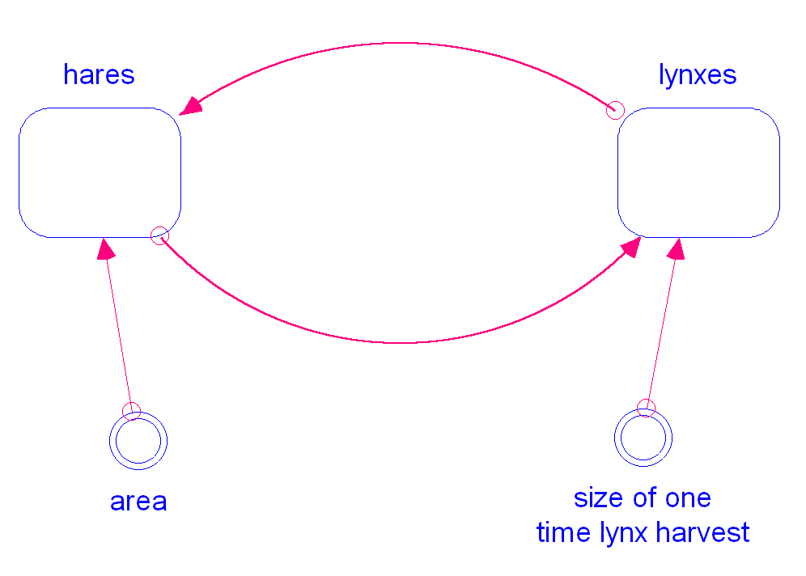

bpowers-hares_and_lynxes_modules
============

This model tests module functionality.  It consists of 3 model
definitions, and the root model has 2 module instances.

Contributions
-------------

| Component             | Author          | Contact                    | Date    | Software Version          |
|:--------------------- |:--------------- |:-------------------------- |:------- |:------------------------- |
| model.stmx            | Bobby Powers    | bobbypowers@gmail.com      | 8/28/15 | Stella 10.0.6 for Win     |
| output.csv            | Bobby Powers    | bobbypowers@gmail.com      | 8/28/15 | Stella 10.0.6 for Win     |
| model.xmile           | Bobby Powers    | bobbypowers@gmail.com      | 8/28/15 | xmileconv v0.1.0          |
