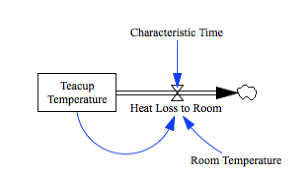
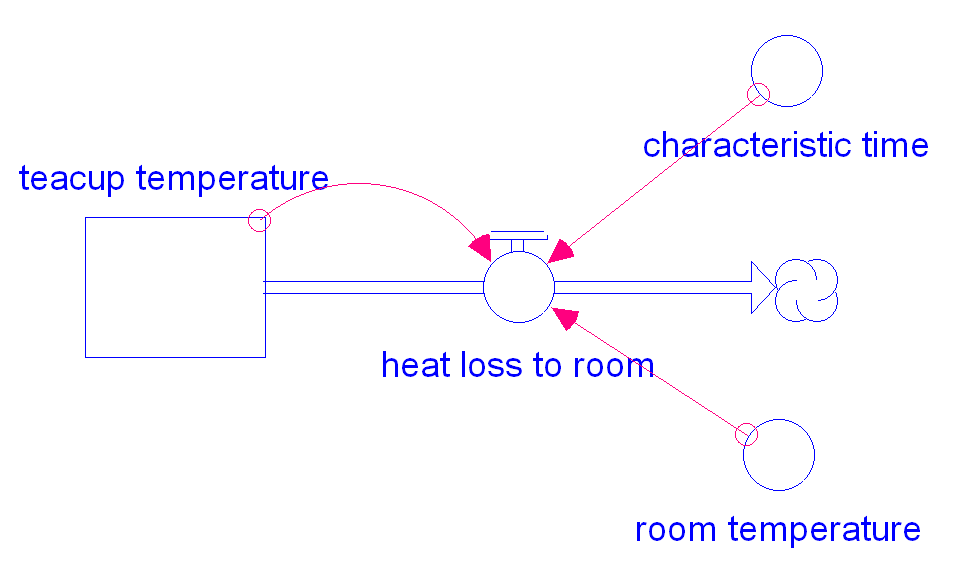

Teacup
======

This model is a ‘hello world’ style demonstration of the test suite format. 

Contributions
-------------

| Component                 | Author          | Contact                    | Date    | Software Version        |
|:------------------------- |:--------------- |:-------------------------- |:------- |:----------------------- |
| teacup.mdl                | James Houghton  | james.p.houghton@gmail.com | 8/27/15 | Vensim DSS 6.3 for Mac  |
| output.csv                | James Houghton  | james.p.houghton@gmail.com | 8/27/15 | Vensim DSS 6.3 for Mac  |
| teacup.xmile              | James Houghton  | james.p.houghton@gmail.com | 8/27/15 |                         |
| teacup.stmx               | Bobby Powers    | bobbypowers@gmail.com      | 8/28/15 | Stella 10.0.6 for Win   |
| output_stella1006.csv     | Bobby Powers    | bobbypowers@gmail.com      | 8/28/15 | Stella 10.0.6 for Win   |
| teacup_w_diagram.xmile    | Bobby Powers    | bobbypowers@gmail.com      | 8/28/15 | xmileconv v0.1.0        |
