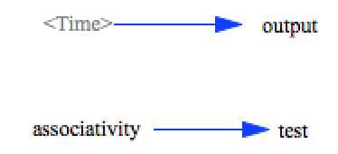

exponentiation
==============

This model tests exponentiation, the right-associativity of it, and
precedence.

Contributions
-------------

| Component             | Author          | Contact                    | Date    | Software Version          |
|:--------------------- |:--------------- |:-------------------------- |:------- |:------------------------- |
| exponentiation.stmx   | Bobby Powers    | bobbypowers@gmail.com      | 8/29/15 | Stella 10.0.6 for Win     |
| output.csv            | Bobby Powers    | bobbypowers@gmail.com      | 8/29/15 | Stella 10.0.6 for Win     |
| exponentiation.xmile  | Bobby Powers    | bobbypowers@gmail.com      | 8/29/15 | xmileconv v0.1.0          |
| exponentiation.mdl    | Bobby Powers    | bobbypowers@gmail.com      | 8/29/15 | Vensim 6.3 DP x32 for Win |
| output_vensim63dp.mdl | Bobby Powers    | bobbypowers@gmail.com      | 8/29/15 | Vensim 6.3 DP x32 for Win |
