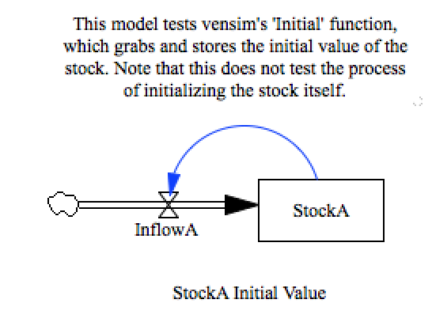

test_initial
============

This model tests vensim's 'Initial' function, which grabs and stores the 
initial value of the stock. Note that this does not test the process 
of initializing the stock itself.

Contributions
-------------

| Component                      | Author          | Contact                    | Date    | Software Version        |
|:------------------------------ |:--------------- |:-------------------------- |:------- |:----------------------- |
| test_initial.mdl               | James Houghton  | james.p.houghton@gmail.com | 8/30/15 | Vensim DSS 6.3 for Mac  |
| output.csv                     | James Houghton  | james.p.houghton@gmail.com | 8/30/15 | Vensim DSS 6.3 for Mac  |

TODO
----
- Stella, XMILE components
