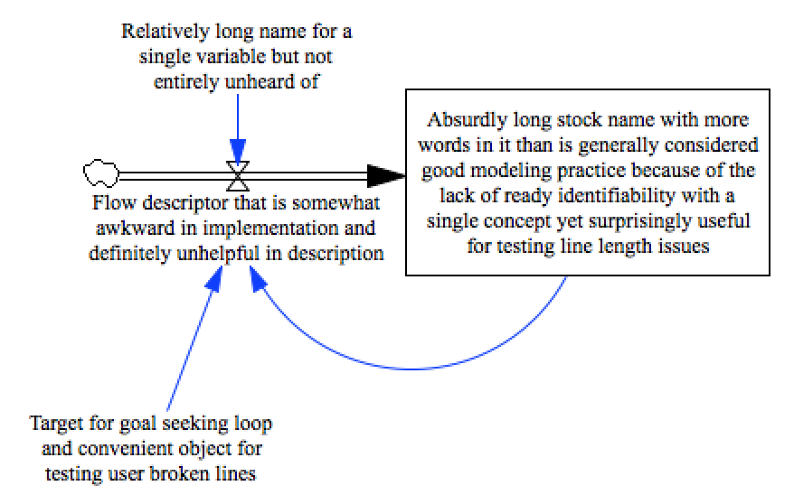

test_line_continuation
===========================

This model tests the ability of a parser to handle long variable names and long equations. In vensim, these are broken into multiple with a `\` that must be dealt with.

Contributions
-------------

| Component                         | Author          | Contact                    | Date    | Software Version        |
|:--------------------------------- |:--------------- |:-------------------------- |:------- |:----------------------- |
| test_line_continuation.mdl        | James Houghton  | james.p.houghton@gmail.com | 11/21/15 | Vensim DSS 6.3 for Mac  |
| output.tab                        | James Houghton  | james.p.houghton@gmail.com | 8/30/15 | Vensim DSS 6.3 for Mac  |
