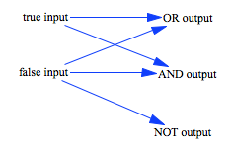
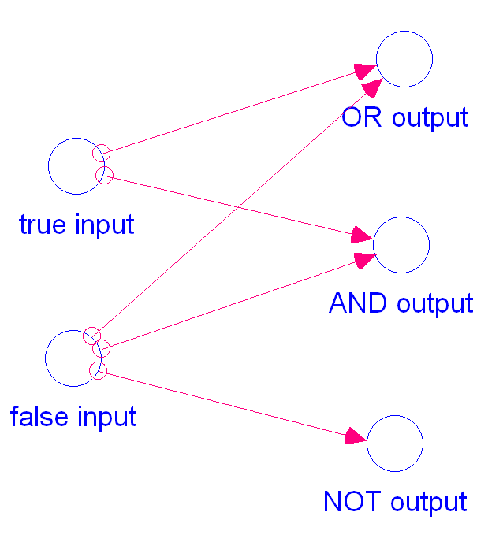

test_logicals
=============

This model tests the `AND`, `OR`, and `NOT` logicals. 

Contributions
-------------

| Component                      | Author          | Contact                    | Date    | Software Version        |
|:------------------------------ |:--------------- |:-------------------------- |:------- |:----------------------- |
| test_logicals.mdl              | James Houghton  | james.p.houghton@gmail.com | 8/28/15 | Vensim DSS 6.3 for Mac  |
| output_vensim63dss.csv         | James Houghton  | james.p.houghton@gmail.com | 8/28/15 | Vensim DSS 6.3 for Mac  |
| test_logicals.stmx             | Bobby Powers    | bobbypowers@gmail.com      | 8/29/15 | Stella 10.0.6 for Win   |
| output.csv                     | Bobby Powers    | bobbypowers@gmail.com      | 8/29/15 | Stella 10.0.6 for Win   |
| test_logicals.xmile            | Bobby Powers    | bobbypowers@gmail.com      | 8/29/15 | xmileconv v0.1.0        |

TODO
----
