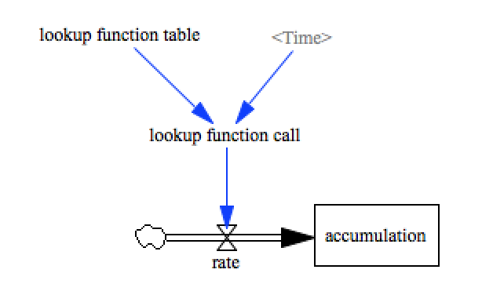
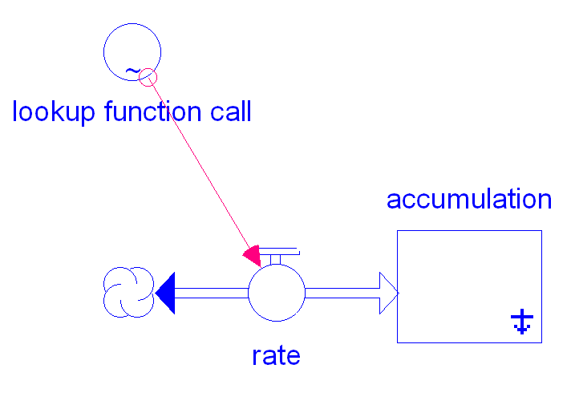

test_lookups
============

This model tests lookup table functionality. It calls upon the time
variable of the model to serve as the input to the lookup table.

From reading the XMILE spec ([section 3.3.2 - Function
Calls](http://docs.oasis-open.org/xmile/xmile/v1.0/cos01/xmile-v1.0-cos01.html#_Toc426543507)),
it seems like the Vensim-style of one aux that just has the graphical
function definition, and another aux to compute the result of looking
up something in that table should be legal. This way you can define a
table once, but do several lookups on it without repeating the table
definition.  But Stella 10.0.6 won't simulate this idiom ([model file
here](test_lookups.stmx)) complains "Syntax error: Unexpected text".

Contributions
-------------

| Component                      | Author          | Contact                    | Date    | Software Version        |
|:------------------------------ |:--------------- |:-------------------------- |:------- |:----------------------- |
| test_lookups.mdl               | James Houghton  | james.p.houghton@gmail.com | 8/27/15 | Vensim DSS 6.3 for Mac  |
| output.csv                     | James Houghton  | james.p.houghton@gmail.com | 8/27/15 | Vensim DSS 6.3 for Mac  |
| test_lookups.stmx              | Bobby Powers    | bobbypowers@gmail.com      | 8/28/15 | Stella 10.0.6           |
| test_lookups_no-indirect.stmx  | Bobby Powers    | bobbypowers@gmail.com      | 8/28/15 | Stella 10.0.6           |
| output_stella1006.csv          | Bobby Powers    | bobbypowers@gmail.com      | 8/28/15 | Stella 10.0.6           |
| test_lookups_no-indirect.xmile | Bobby Powers    | bobbypowers@gmail.com      | 8/28/15 | xmileconv v0.1.0        |

TODO
----
- Get clarification on Stella behavior w.r.t. indirect lookups
