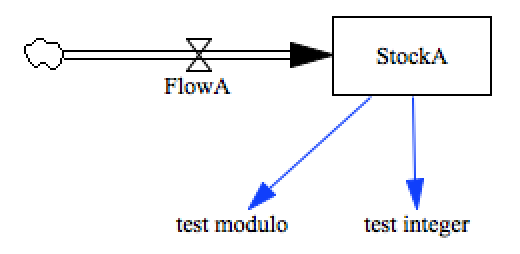

test_rounding
=============

This model tests various types of rounding

- INT : translation from float to integer
- modulus : remainder from integer division

Contributions
-------------

| Component                         | Author          | Contact                    | Date    | Software Version        |
|:--------------------------------- |:--------------- |:-------------------------- |:------- |:----------------------- |
| test_rounding.mdl                 | James Houghton  | james.p.houghton@gmail.com | 9/02/15 | Vensim DSS 6.3 for Mac  |
| output.csv                        | James Houghton  | james.p.houghton@gmail.com | 9/02/15 | Vensim DSS 6.3 for Mac  |
