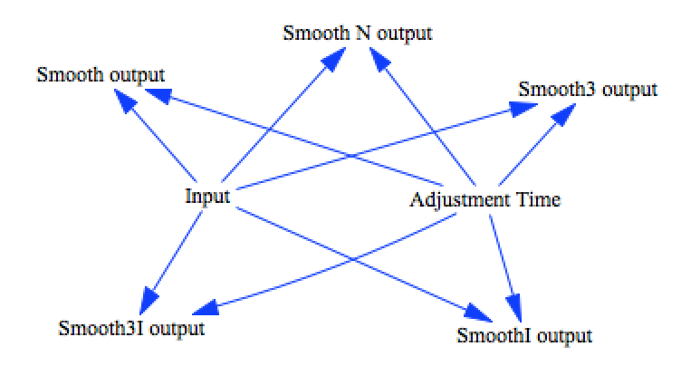

test_smooth
===========

This model tests basic smoothing functionality

-Smooth, Smooth3, Smooth N
-SmoothI, Smooth3I

Contributions
-------------

| Component                         | Author          | Contact                    | Date    | Software Version        |
|:--------------------------------- |:--------------- |:-------------------------- |:------- |:----------------------- |
| test_smooth.mdl                   | James Houghton  | james.p.houghton@gmail.com | 8/30/15 | Vensim DSS 6.3 for Mac  |
| output.csv                        | James Houghton  | james.p.houghton@gmail.com | 8/30/15 | Vensim DSS 6.3 for Mac  |
