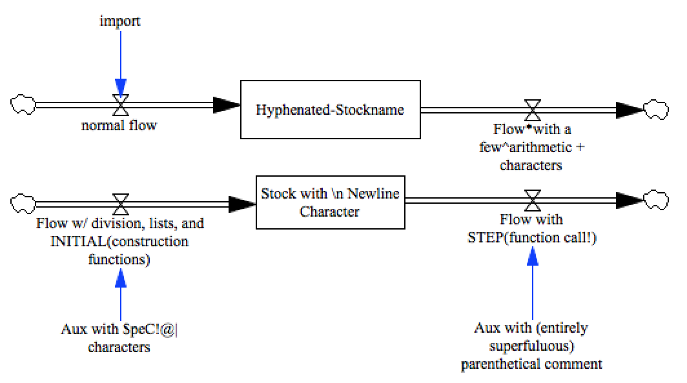

test_special_variable_names
===========================

This model tests the use of several special characters and constructions in variable names:

- Non Alphanumeric Characters
- Newline characters
- Arithemtic Operators
- Function Calls within Variable Names
- Commas, lists
- Parenthetical Comments
- Hyphenated Names

Contributions
-------------

| Component                         | Author          | Contact                    | Date    | Software Version        |
|:--------------------------------- |:--------------- |:-------------------------- |:------- |:----------------------- |
| test_special_variable_names.mdl   | James Houghton  | james.p.houghton@gmail.com | 8/30/15 | Vensim DSS 6.3 for Mac  |
| output.csv                        | James Houghton  | james.p.houghton@gmail.com | 8/30/15 | Vensim DSS 6.3 for Mac  |
