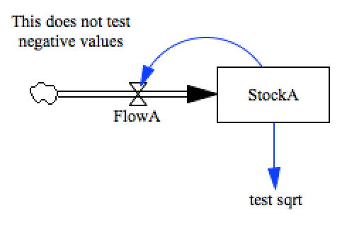

test_sqrt
=========

This model tests the square root function.

Ideally we would test over both negative and positive values, to ensure that there is some form
of graceful handling. However, Vensim (at least) does not seem to hadle square roots gracefully,
so its hard to generate a good test case!

Contributions
-------------

| Component                         | Author          | Contact                    | Date    | Software Version        |
|:--------------------------------- |:--------------- |:-------------------------- |:------- |:----------------------- |
| test_sqrt.mdl                     | James Houghton  | james.p.houghton@gmail.com | 9/02/15 | Vensim DSS 6.3 for Mac  |
| output.csv                        | James Houghton  | james.p.houghton@gmail.com | 9/02/15 | Vensim DSS 6.3 for Mac  |
