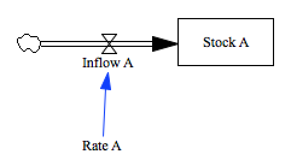

test_subscript_nd_arrays
========================

There are a number of different features that make up the full functionality we know as 
'subscripts'. We'll break them all into separate tests to ease the development effort.

This tests a second dimension of subscripting (which requires special syntax for handling )

Contributions
-------------

| Component                         | Author          | Contact                    | Date    | Software Version        |
|:--------------------------------- |:--------------- |:-------------------------- |:------- |:----------------------- |
| test_subscript_2d_arrays.mdl      | James Houghton  | james.p.houghton@gmail.com | 9/18/15 | Vensim DSS 6.3 for Mac  |
| output.csv                        | James Houghton  | james.p.houghton@gmail.com | 9/18/15 | Vensim DSS 6.3 for Mac  |