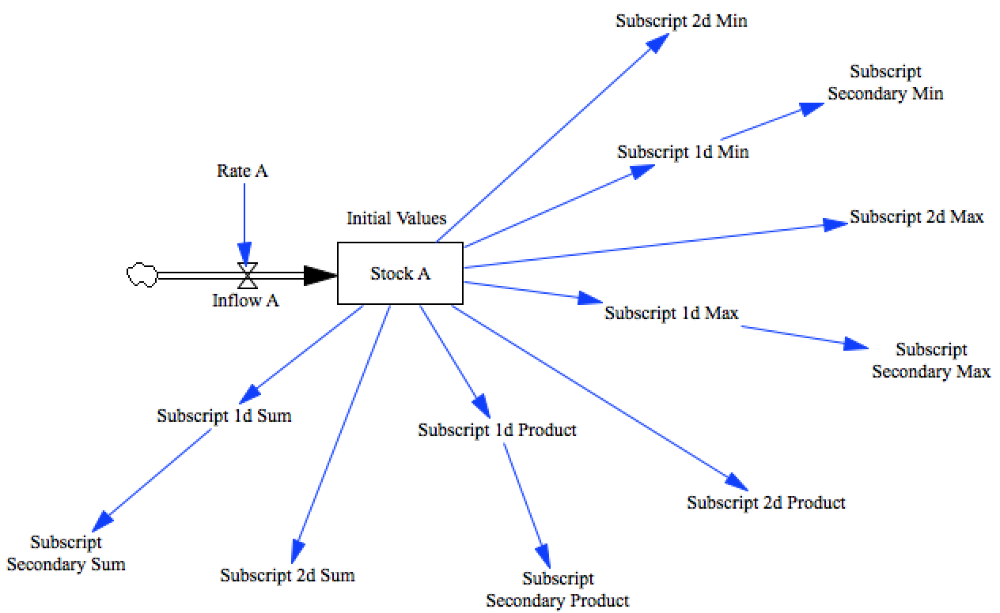

Test Subscript Aggregation
==========================

There are a number of different features that make up the full functionality we know as 
'subscripts'. We'll break them all into separate tests to ease the development effort.

This test aggregates the result of several subscripts using the various aggregation functions.

Contributions
-------------

| Component                         | Author          | Contact                    | Date     | Software Version        |
|:--------------------------------- |:--------------- |:-------------------------- |:-------- |:----------------------- |
| test_subscript_aggregation.mdl    | James Houghton  | james.p.houghton@gmail.com | 10/20/15 | Vensim DSS 6.3 for Mac  |
| output.csv                        | James Houghton  | james.p.houghton@gmail.com | 10/20/15 | Vensim DSS 6.3 for Mac  |

Todo:
Make a case where we sum over (say) dimensions 1 and 3, but not 2