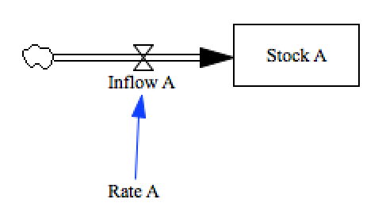

Test subscript individually-defined 1d arrays
--------------------------------------------

There are a number of different features that make up the full functionality we know as 
'subscripts'. We'll break them all into separate tests to ease the development effort.

This test exercises vensim's capability to define subscript values not using `comma, colon;` syntax, but using individual entries for each element. In this example:

~~~
Rate A[Entry 1]=
	0.01 ~~|
Rate A[Entry 2]=
	0.2 ~~|
Rate A[Entry 3]=
	0.3
	~	
	~		|
~~~

Contributions
-------------

| Component                         | Author          | Contact                    | Date    | Software Version        |
|:--------------------------------- |:--------------- |:-------------------------- |:------- |:----------------------- |
| test_subscript_1d_arrays.mdl      | James Houghton  | james.p.houghton@gmail.com | 11/17/15 | Vensim DSS 6.3 for Mac  |
| output.csv                        | James Houghton  | james.p.houghton@gmail.com | 11/17/15 | Vensim DSS 6.3 for Mac  |
